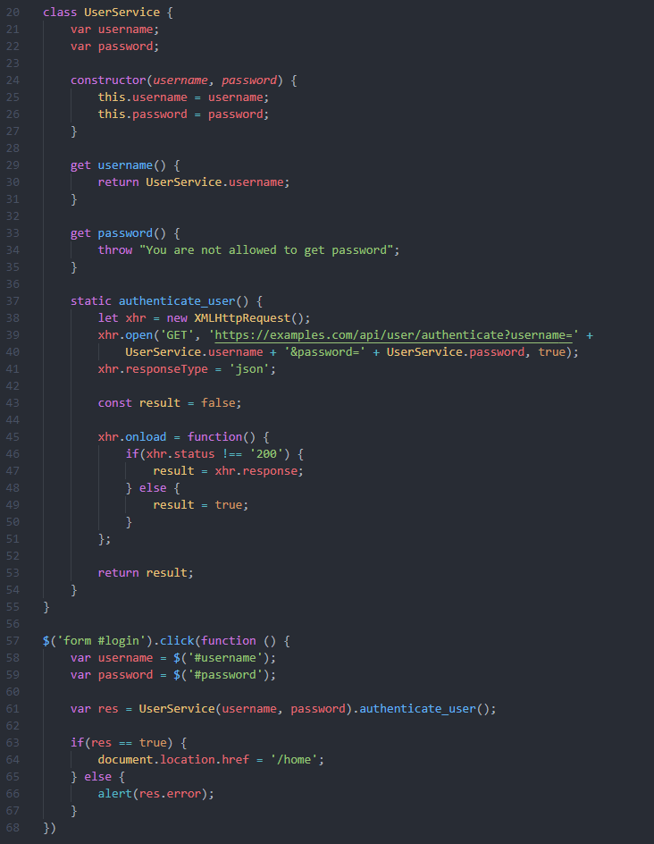
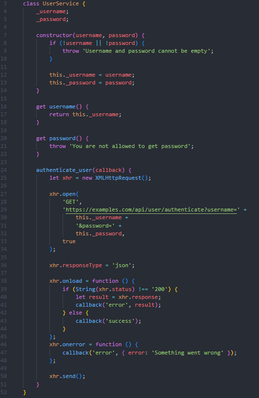
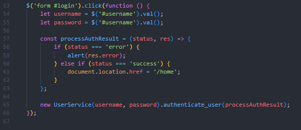

# Тестовое задание NewGen Vision
Задача:  Опишите, какие проблемы вы здесь видите (оформление, логика, концепция). Как бы вы доработали данный код, используя ту же основу?

# Исходный код

# Список ошибок и недочетов (в скобках указаны строки)
## 1) JQuery
### 1.1) Объекты форм вместо логина и пароля (58, 59)
При таком обращении JQuery будет возвращать сами объекты, для которых указан передаваемый id. Если мы хотим получить сами значения, то следует вызывать у каждого из этих объектов `.val()`.

### 1.2) Обращение к форме с id "login" с пробелом (57)
Селектор будет искать внутри формы поле с id "login", если же мы хотим обратиться к самой форме с таким id, то следует обращаться `$(form#login)`.

### 1.3) Привязка обработчика на клик по форме (57)
Обработчик будет вызывать каждый раз, когда мы будет кликать на форму, вместо того, чтобы вызываться при отправке формы. Для того, чтобы оно работало как надо, следует заменить `click` на `submit`.

"Ошибки" из пунктов 1.1 и 1.2 допустимы, если у нас внутри формы присутствует кнопка отправки с `id="login"`, при клике на которую эта форма отправляется. В таком случае можно счесть недочетом сам такой id, название которого не подразумевает кнопку.

## 2) Классы
### 2.1) Вызов конструктора класса без ключевого слова new (61)
При вызове конструктора таким образом будет выдаваться ошибка, необходимо изменить на `var res = new UserService(username, password).authenticate_user()`

### 2.2) Объявление полей класса с ключевым словом var (21 и 22)
Выдаст ошибку, объявлять поля следует без ключевого слова (просто `username` и `password`).

### 2.3) Поля и геттеры с одинаковыми именами (21 и 29,  22 и 33)

При объявлении полей класса `username` и `password` обращение происзодит к ним, а не геттерам, либо выдается ошибка.

В данном случае следует либо изменить название полей, например на `_username` и `_password`, тогда при обращении к полям без _ будут вызываеться именно геттеры, либо можно сделать поля приватными с помощью # (`#username`, `#password`), тогда к ним можно будет обратиться только с помощью геттеров.

### 2.4) Обращение к классу, а не к объекту класса (this) (30, 40)
Для класса `UserService` поля `username` и `password` изначально `undefined`, чтобы получить значения, переданные в конструктор, следует обращаться к ним через `this`.

### 2.5) Вызов статичного метода для объекта класса (61)
Метод `authenticate_user` является статичным, его невозможно вызвать для объекта класса.

### 2.6) Объявление статичным метода, которому необходим доступ к полям класса для работы (37)
Метод `authenticate_user` является статичным, при этом ему необходимы поля `password` и `username`, которые передаются через коструктор, в статичном же методе их не получить.

### 2.7) Обращение к защищенному геттеру password в методе (40)

При обращении к геттеру должна выдаваться ошибка. Соответсвенно, нeобходимо обращаться напрямую к полю `password`, например изменив его на `_password` или `#password`.

## 3) Запрос XMLHttpRequest и асинхронность
### 3.1) Запрос XMLHttpRequest не отправляется
Запрос необходимо отправить с помощью `xhr.send()`.

### 3.2) XMLHttpRequest выполняется асинхронно, но его никто не дожидается
Из-за этого функция `authenticate_user` будет всегда вовзращать `result`, равный `false`.

Для того, чтобы код все-таки выполнялся, мы можем перенести код из блока 63-67 в функцию `onload`. Либо создать функцию `callback`, передавать её в `authenticate_user` и вызывать внутри `onload`.

### 3.3) Нет обработки ошибок для самого запроса
В коде присутсвует обработка ошибки только если запрос вернул статус отличающийся от 200. При этом, может быть проблема с самим запросом, например проблема с сетью. Поэтому для `xhr` следует добавить функцию `onerror`

## 4) Общее
### 4.1) Сравение с булевым значением в условии if (63)
Сравнение `res == true` имеет мало смысла, можно просто написать `if (res)`.

### 4.2) Использование var вместе c let и const
Использование `let` и `const` предпочтительнее из-за их блочной области видимости. Их использование может сделать поведение более предсказуемым и уберечь от ошибок. 

Использование `var` может быть оправдано, если мы хотим, чтобы наш код запускался в старых версиях браузеров (хотя все современные версии уже поддерживают `let` и `const`). Использование же одновременнно всех трех типов ключевых слов не имеет смысла.

### 4.3) Некорректная обработка res  (63 - 66)
`res` может быть `false`, тогда свойства `error` у него не будет, будет `alert(undefined);`

Для исправления надо либо изменить сам запрос аутентафикации, либо сделать проверку на наличие поля `error`. Также может возникать проблема, если будет возвращаться объект, наличие объекта будет означать `true`, поэтому будет редирект на главную страницу, даже если вернулась ошибка.

Как вариант, из функции `authenticate_user` можно возвращать статус (`"error"` или `"success"`) и какой-то payload, и уже обрабатывать их.

### 4.4) Отсутствует преобразование к одному типу перед сравнением (46)
Поле status сравнивается со строкой, при этом само поле может быть числом. Необходимо преобразование: `String(xhr.status)` 

## 5) Прочие доработки
### 5.1) Нет валидации полей
Сейчас могут устанавливаться пустые значения для `username` и `password`, соответсвенно запрос на аутенттификацию в таком случае не имеет смысла. Я бы добавил валидацию либо в конструктор, либо в метод запроса, что-то вроде `if (!username) throw "Username cannot be empty"`

# Код после исправления

